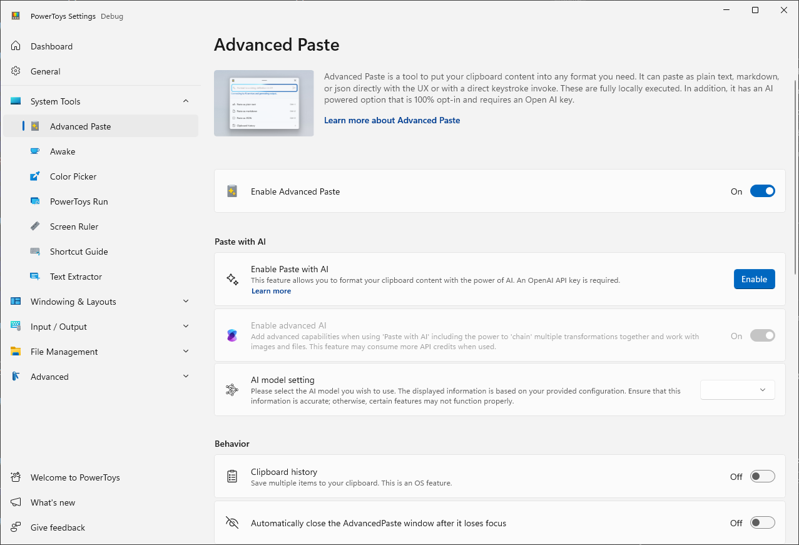
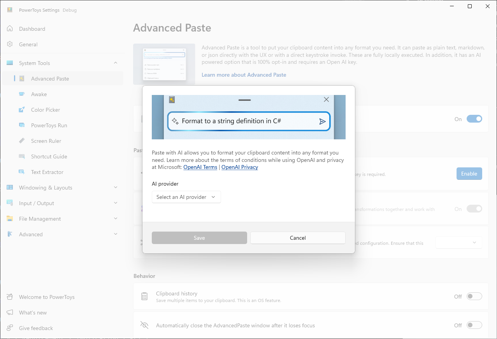
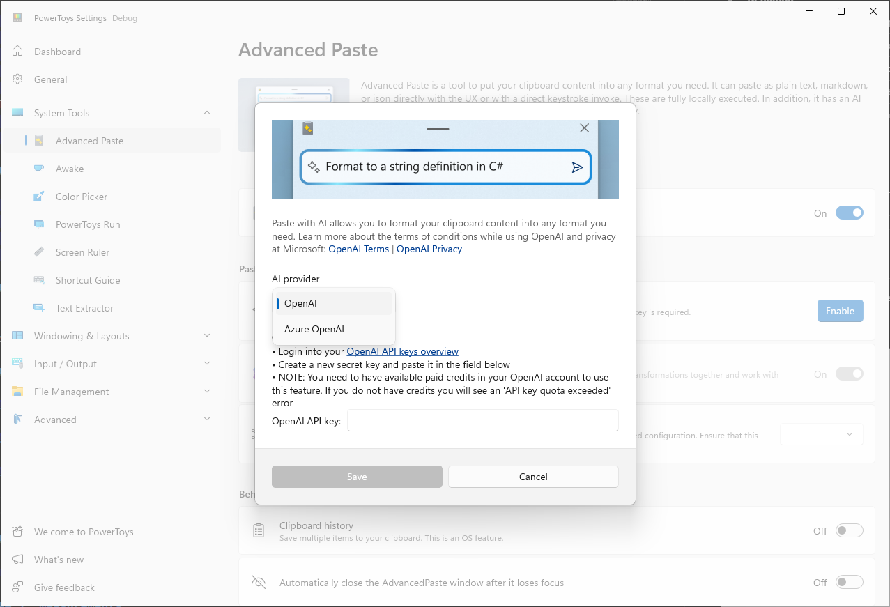
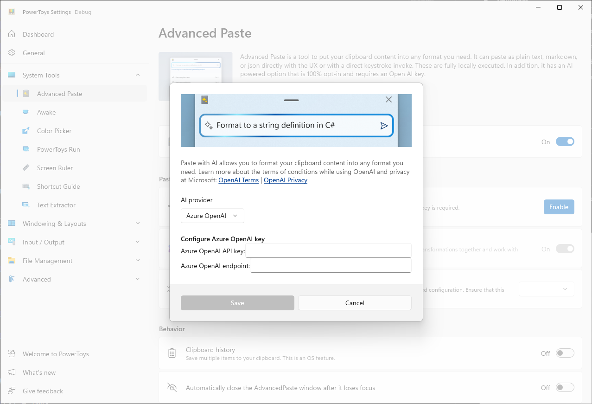
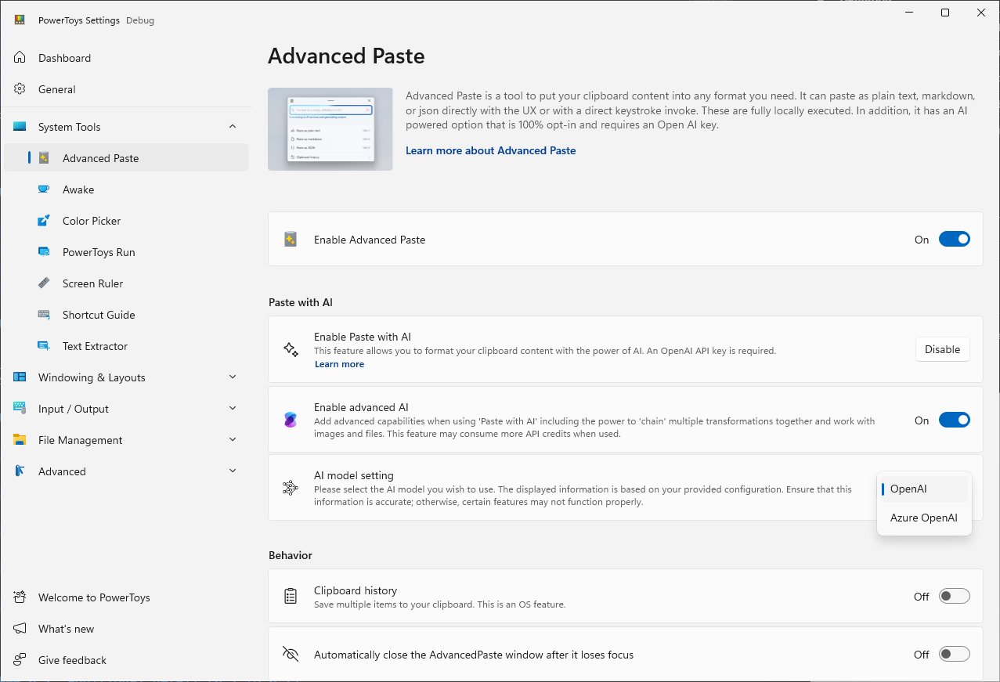
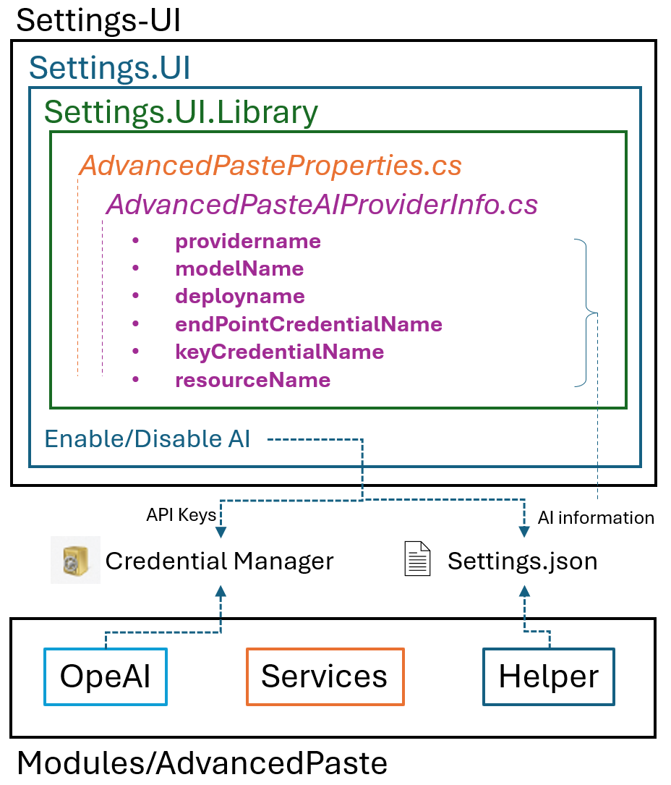

# DRAFT

# Add Azure OpenAI support to AdvancedPaste


- **What is it:** Enable AdvancedPaste to support Azure OpenAI's GPT models and allow seamless switching between different models.
- **Authors:** Shuaiyuanxx
- **Spec Status:** Draft

## 1: Overview

### 1.1: Executive overview (max 150 words)

Currently, AdvancedPaste only supports OpenAI, which limits the flexibility of the product.
Users may have subscriptions to either OpenAI, Azure OpenAI, or both. Therefore, enabling AdvancedPaste to support both types of AI subscriptions can significantly enhance user experience and satisfaction. 

### 1.2: Goals/Non-goals

#### 1.2.1: Goals

 - Enable AdvancedPaste to support Azure OpenAI GPT models.
 - If users have both OpenAI and Azure OpenAI set up, they can choose the model they want to use.
 - Users can check if the model is configured correctly during the setup process.

#### 1.2.2: Non-goals

 - Currently, LLMs from other sources are not supported.

## 2: Requirements

### 2.1: Core requirements

| # | Definition | Priority |
|---|------------|----------|
| 1 | Any model deployed on Azure OpenAI should be supported | P0 |
| 2 | The first configured AI model should be selected for the user by default | P0 |
| 3 | If multiple models are available, provide an easy way to switch between them | P0 |
| 4 | Existing functionality should not be affected. | P0 |
| 5 | Provide a method to verify if the model configuration is correct | P1 |

### 2.2: Security

| # | Definition | Priority |
|---|------------|----------|
| 1 | Sensitive information should not be exposed | P0 |
| 2 | Use Credential Manager to store and access sensitive information | P0 |

## 3: Functional design

_* Note that the following illustrations are for functional explanation and demonstration purposes only and may change with version updates._

### 3.1: Settings UI design

#### 3.1.2 The main interface for AI configuration in AdvancedPaste settings page

In the "Paste with AI" section, we need to add an option allowing users to select their preferred model when multiple configured models are available. 

- If no AI is successfully configured, this option will be disabled. 
- If only one AI model is available, it will be selected by default.



#### 3.1.3 The AI configuration sub-interface

The configuration interface that appears when the user clicks the "Enable" button. Here, users can select the type of AI provider they want to configure. Currently, only "OpenAI" and "Azure OpenAI" are supported.



When "OpenAI" is selected, the original content is displayed, and the user only needs to provide the "OpenAI API Key" as before.



When "Azure OpenAI" is selected, the following four fields need to be filled out (The image only shows two fields):

- API Key
- Endpoint
- Deployment Name
- Model Name (e.g. gpt-4o-mini)



#### 3.1.4 The main interface after the user has completed the configuration

At this point, the "AI Model Setting" section should be active, the content in the ComboBox should automatically select one of the AI models configured by the user, and the "Enable" button in the "Enable Paste with AI" section should change to a "Disable" button.


Finally, if the user has configured multiple available models, the "AI Model Setting" section should allow the user to switch between them freely.



### 3.2: Software architecture design



As shown in the diagram, to implement this feature, two major parts need to be modified:

1. **Settings-UI**  
   We need to add a new class, `AdvancedPasteProperties`, to the existing `Settings.UI.Library` to store the necessary information related to the AI models. These details include:
   - **providerName**: Whether the model is provided by OpenAI or Azure OpenAI.
   - **modelName**: The model name, e.g., gpt-4o-mini, that the user has deployed.
   - **deployName**: The deployment name, which is usually only needed for Azure OpenAI.
   - **endPointCredentialName**: Used to save/read the endpoint value from Credential Manager, which is usually required only for Azure OpenAI. This is used when constructing and obtaining `Windows.Security.Credentials.PasswordCredential`.
   - **keyCredentialName**: Used to save/read the API key value from Credential Manager. This is also used when constructing and obtaining `Windows.Security.Credentials.PasswordCredential`.
   - **resourceName**: For OpenAI, this value is typically "https://platform.openai.com/api-keys"; for Azure OpenAI, it is "https://portal.azure.com/". This is used when constructing and obtaining `Windows.Security.Credentials.PasswordCredential`.

   When the user triggers the **Enable/Disable** button on the AdvancedPaste configuration UI, the API keys and endpoint (if applicable) values will be saved in Credential Manager, while the other information will be written to the `Settings.json` file.

2. **AdvancedPaste Module**  
   This part consists mainly of three sections: **OpenAI**, **Services**, and **Helper**.  
   The **Helper** will fetch the user's configuration information from `Settings.json`, such as the model they prefer to use. When a new request requires AI to process clipboard content, the **OpenAI** component will attempt to read the saved API key and endpoint (if necessary) from Credential Manager based on the user's configuration, in order to create the AI instance and get the processed result.

## 4: Measurements

| # | Requirement | Implication | Pri |
| - | ------------|-------------|-----|
| 1 | Amount of people that enabled Azure OpenAI | Help understand whether the user is more inclined to use Azure OpenAI or OpenAI | P1 |

## 5: Future considerations

1. Add support for more AI models, such as local AI models
2. Optimize the UI configuration interface
3. Offer an option to validate the accuracy of AI-related configuration settings

## 6. Appendix

Class `PasswordCredential`
```cs
Windows.Security.Credentials.PasswordCredential(string resource, string userName, string password);
```